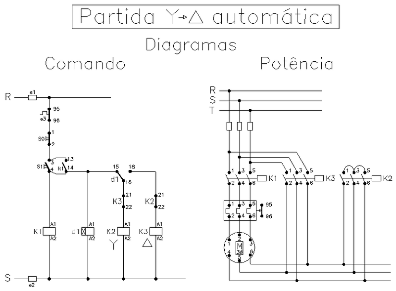

# Partida Estrela Triângulo
1. Objetivo: Partida Estrela-Triângulo

Desenvolver uma aplicação, projeto eletrônico e programa, para um dispositivo de comando para partida Estrela-Triângulo. 

2. Requisitos da solução

    Interface
        Botão de partida: S1;
        Botão de parada: S0;
        Contatores de acionamento do motor: K1, K2 e K3.
    Comportamento
        Ao pressionar S1
            Ligar K1, K2 (fechamento estrela);
            Temporizar 5 segundos
            Desligar K2 e ligar K3 (fechamento triângulo).
        Ao pressionar S0, em qualquer momento:
            Desligar todos os contatores.
    Estrutura (Hardware): Circuito eletrônico
        Acionamento via Relé ou transistor;
        Tensão operação: 24V, 12V ou 5V.

3. Planejamento da solução

    Planejamento do produto final
        Projeto em plataforma de versionamento;
        Código fonte;
        Simulação;
        Protótipo (opcional);
        Circuito eletrônico (opcional).

    Planejamento das ferramentas e materiais

    Planejamento do processo
        Criar o projeto na plataforma de versionamento;
        Definir mapa de entradas e saídas;
        Construir o circuito no simulador;
        Criar projeto de validação do circuito no simulador;
        Criar programa(firmware) da aplicação;
        Montar circuito em matriz de contatos;
        Testar programa(firmware) na montagem do protótipo;
        Registrar resultado da atividade.

4. Solução

